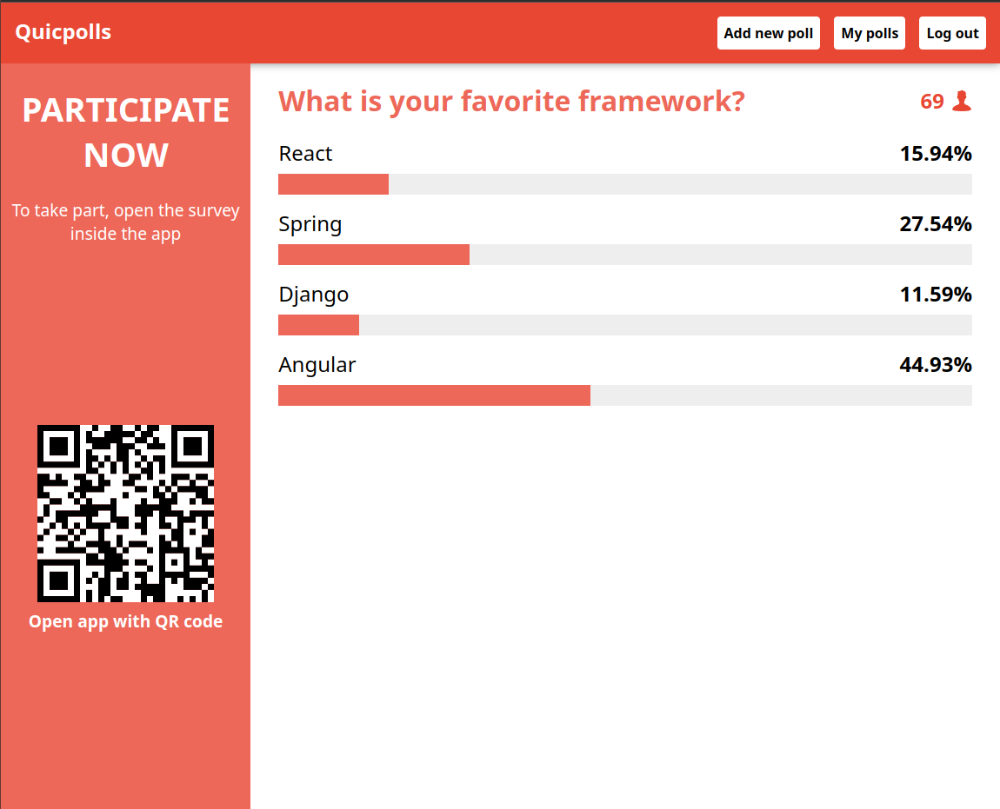

# Quicpolls

User-friendly app that lets you create and manage surveys during events. Participants can easily access surveys without being logged in by scanning a QR code, and results are displayed in real time on a dashboard. The app also includes a panel for managing all of your surveys in one place.

App is hosted on: https://mszawerd.toadres.pl/

## Technologies

- React
- Vite
- Typescript
- Supabase(PostgreSQL)

## Poll results dashboard

## Poll survey

## User polls

## Adding poll

## Login page

